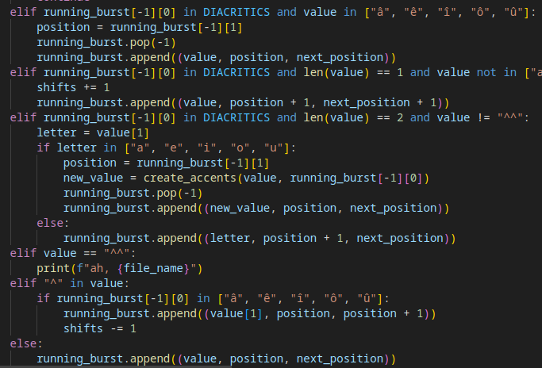

This document can be used as a manual to understand more deeply each script and code.
Given the nature of the studied data, some codes would deserve improvements and others might raise questions. 
For this exact reason, this document will details each script and gives examples. Reading it might greatly help any new member of this project.


# Table of contents
1. [IDFX EXTRACTION](#extraction)
2. [TEXT RECONSTRUCTION](#reconstruction)
3. [Text reconstruction](#reconstruction)
4. [Chunking](#chunking)


Before going into each part of the process. I will quickly summarise each step.

- ### IDFX EXTRACTION

The first step was to extract the information contained in the IDFX files. These files were retrieved using the InputLog Software and its Microsoft Word version. In this document, I will explain how to download the software and use it to simplify working on the give data. I will also present how the files are structured. I will then go through the `retrieval.py` script to explain how the data was retrieved and processed to be stored in CSV files such as the one shown in the `README`. I will go through the script to explain each step and how it could be adapted for further processing. I will give you insight as to how check errors and exceptions so that you can directly start from the existing scripts. 

- ### TEXT RECONSTRUCTION

The second step was to use the resulting CSV file to rescontruct each text. Reconstructing each texts consists in mimicking each of the user's actions (adding characters, deletionsn movements...) up until getting the final version of the text, there is to say the version that was saved as a txt file. The `reconstruction.py` script will be explained in depth to show how exceptions were handled and hopefully allow you to adapt it as you wish. I will also present the `compararison.py` script allowing you to check texts with reconstruction errors. 
This script also aimed to reconstructing text while adding special characters to represent actions. `~` were for instance used to represent deletions. 

- ### CHUNKING 

The third step was to use `SEM` to chunk our texts. The reconstruction step allowed us to get data that could trace the actions of a user while keeping the final texte, and therefore allow us to see if some words were for instance most often found after deletions. Chunking our text could give use another analysis layer, allowing us to identify grammatical chunk and see, for instance, if deletions were most often found before verbal chunks. I will explain the `chunking.py` script as well as the steps required to use SEM. 

- ### STATISTICS 

This step is the less finalized step of the projet. It aims to get numbers regarding possible connections between types of errors or actions and grammatical units. 


# 1 - IDFX EXTRACTION <a name="extraction"></a>

In order to vizualize and study writing behaviours, the first step is to retrieve the data from the idfx files created by InputLog.

**This extraction is handled by the `retrieval.py` script.**
This script is long and may require modifications if you intend to retrieve aditional data (that can be found in the idfx files or within another corpus).

## InputLog

InputLog is available on Windows and Mac. On LINUX, I would recommend installing a Virtual Machine to be able to use it. Furthermore, the corpora used in this repository were collected using InputLog with MicrosoftWord. Word, as a software, has multiple specificites that require specific processing during the retrieval. These exceptions will be listed down below.

It can be downloaded on the [InputLog Website](https://www.inputlog.net/). You'll need to ask for a login to use the software, the process is detailed on the website as well. The login is fast to get but you need to make the request and use your research or academic credentials to be granted one. 

Using InputLog is not complicated but it could get a little while to get used to it. I used the Word version (because it was the one used during the collection of the data). You therefore need Word on Mac or on Windows. 

To lauch InputLog, click on its icon. It will open a window asking for some information. 

Once you provided the desired info, click on `Record`.

It will open a blank Microsoft Word document. To check that InputLog is indeed recording your actions, you can click on the littler InputLog icon that can be found in your toolbar. It will open a window where you should see `stop recording`.

After writing you text, click on the InputLog icon and click on stop recording. You document should be automatically saved, but you can presse `CTRL` + `S` in case. You can close InputLog.
Your Word document, as well as an InputLog object should be saved somewhere on your computer. They normally should be saved in the `Documents` directory and ordered by users and sessions. 

You can open the InputLog document with any text app such as `blocnote` to see the data formatted just like the IDFX files. 

**Using InputLog is extremely useful to understand how some errors might occur in the retrieval or in the reconstruction of the texts.** Trying to write the text yourself, by following the IDFX files, is probably the best way to understand errors. Using InputLog yourself can be however extremly consuming and it might be easy to loose track of what you're writing. I suggest recording your screen and using Macros to create a dedicated function that could display the index the characters you're writing in the bottom left corner of your window. Such function can easily be found on Google. 

It might not work but here is an example :

``` Dim NextUpdate As Date 
    Sub StartTracking() ' Start the tracking process 
    Call TrackCharacterIndex 
    End Sub 
    
    Sub TrackCharacterIndex() 
    Dim charIndex As Long 
    Dim charCount As Long ' Get the current character index 
    charIndex = Selection.Start ' Get the total character count in the document 
    charCount = ActiveDocument.Content.Characters.Count ' Display the current character index in the status bar 
    Application.StatusBar = "Character Index: " & charIndex & " of " & charCount ' Schedule the next update 
    NextUpdate = Now + TimeValue("00:00:01") 
    Application.OnTime NextUpdate, "TrackCharacterIndex" 
    End Sub 
    
    Sub StopTracking() ' Stop the tracking process 
    On Error Resume Next Application.OnTime EarliestTime:=NextUpdate, Procedure:="TrackCharacterIndex", Schedule:=False Application.StatusBar = False ' Clear the status bar 
    End Sub
```

Good luck !

## IDFX Files

I will now try to explain as best as possible how the IDFX files (resulting from using InputLog) are structured and how these structures need to be taken into account for further processing.

### Basic structure


Each IDFX file contains a sequence of actions recorded on Word. For instance, in this example, you can see that the user pressed the D key, in position 0. IDFX files are structured around tags. 

The ones that you'll see the most while working on those files are the `keyboard` event.
These events correspond to the action of pressing a key on the keyboard. Each `keyboard` event is composed of two `part` tags. 
The first `part` tag, with the `wordlog` type, gives information about the position of the cursor for the given key, and the length of the document after that key was pressed. The `replay` tag is set to `False` for control keys such as `SHIFT` or `BACK`.

The second `part` tag, the `winlog` one, is used to give information about the starttime of the action (so here, the key was pressed at 941 303 ms), the endtime, the name of the key `VK_D`, and its corresponding grapheme, here, `D`. You'll also find information in the `keyboardstate` tag that we'll explained further down in this document. The `winlog` tag is also used for other actions, notably ones involving the mouse. These actions do not concern us.

**To understand better those files**, it is important to recognize more special keys :

- Letters are represented by keys such as : `VK_D`. Upper case letters are represented in the same way but can be preceeded by a `SHIFT` key. 

- Control characters, such as the ones used to move, delete, or add spaces have their own keys.
    - `VK_SPACE` are for regular spaces.
    - `VK_TAB` are used for tabulations.
    - `VK_BACK` are used for deletions (with the common deletion key on the right part of the keyboard).
    - `VK_DELETE` are used for foward deletion (with the use od the `suppr` key on most keyboard).
    - `VK_LEFT` are used to move to the left (one position).
    - `VK_RIGHT` are used to move to the right (one position).
    - `VK_UP` are used to move to the top (positions vary).
    - `VK_DOWN` are used to move to the bottom (positions vary).
    - `VK_RETURN` are used for line breaks.
    - `VK_END` are rare, but seem to represent `end` keys that can be found on Mac. They keys allow the user to go to the very bottom of the document.

- Special characters.
    - `VK_RSHIFT` when pressing the right shift key.
    - `VK_LSHIFT` when pressing the left shift key.
    - `VK_CAPITAL` when pressing the caps lock key.
    - `VK_OEM_` keys are used for accents and other diacritics.
        - `VK_OEM_2` is used to create `:` or `/` when the `VK_CAPITAL` key was pressed right before. 
        - `VK_OEM_3` is used to create the accented u `ù` and `%` when a shift key was pressed right before. 
        - `VK_OEM_4` creates the right paranthesis `)`.  
        - `VK_OEM_5` creates an aterix `*`.
        - `VK_OEM_6` used for hat accents (accent circonflexe) such as `ê`. A lot of problems stem from cases where accents are not processed correctly. I would avise trying to collect data without using them in the futur. Some of these problems were dealt with (as I explained it further down below) but not all cases were covered. 
        - `VK_OEM_6` is also used for diaeresis accents (accent trema) such as `ï`. Just like for the hat accents, the accents might cause multiple processing problems. They are created just like the hat ones but with a keyboard state containing a `SHIFT` key. The user needs to press one of the upper case key before pressing the `¨` key on  the keyboard. 
        - `VK_OEM_8` is used to create an exclamation mark `!`.
        - There are probably more accented characters that should be properly processed such as an eventual `~`. Refer to the explanations down below to deal with such cases.
    - `VK_OEM_` keys are furthermore used for punctuation marks.
        - `VK_OEM_COMMA` is used for commas `,`.
        - `VK_OEM_COMMA` is used for question marks when used after pressing the `VK_CAPITAL` key.
        - `VK_OEM_PLUS` is used to create the equal symbol `=`. 

    - `VK_DECIMAL` keys are used for full stops `.`.
    - Keys with numbers correspond to the sequence of keys with numbers at the top of the keyboard. 
        - `VK_1` creates the character `&` when pressed. 
        - `VK_2` creates an acute e `é` when pressed.
        - `VK_3` creates double quotes `"` when pressed.
        - `VK_4` creates an apostrophe `'` when pressed.
        - `VK_5` creates a left paranthesis `(` when pressed.
        - `VK_6` creates a hyphen `-` when pressed.
        - `VK_7` creates a grave e `è` when pressed.
        - `VK_8` creates a underscore `_` when pressed.
        - `VK_9` creates a cedilla c `ç` when pressed.
        - `VK_0` ceates an accented a `à` when pressed. 

    Many characters haven't been found or haven't been processed in the studied corpora. Most of them probably can be dealt with by handling key combinations such as `VK_RSHIFT` followed by `VK_OEM_PLUS` to create `+` for instance. 

- Some keys are also used for other type of actions. These keys do not change the position of the user within the idfx file. They are mostly easy to handle.
    - `VK_LMENU` and `VK_APPS` open a menu.
    - `VK_ESCAPE` is the escape key.
    - `VK_F12` is a shortcut to save the file.
    - `VK_SNAPSHOT` is used to take a screenshot.
    - `VK_INSERT` changes the writing mode.
    - `VK_LCONTROL` and `VK_RCONTROL` are the control keys located on the left and right part of the keyboard.

## retrieval.py

Let's now get into the `retrieval.py` script. The script is heavily commented so I recommend following these explanations while reading the code.

This script is long and contains really long functions. 
The script might return an error if there is a processing error in one of the file. These kind of errors mostly concern characteers that were not handled previously. If you want to deal with those errors, I recommend removing the `Try Except` in the `main` function. However, the script works (does not return errors) for all of the files of the `planification` corpus.


The scripts uses an argparse that requires two arguments : `-c` the name of the folder containing the idfx files. `-t` the pause thresold, there is to say the value of the pauses taken into acount to divide the data into bursts. 

Example : `python3 retrieval.py -c planification -t 1.5`

Running the script should create a CSV file named after the chosen corpus in the `data/table/` directory. 

Let's go through each step of the script.

A burst can be on multiple rows in the resulting CSV file. This is because each row has its start and end position in two columns. However, you'll see that the user sometimes use control characters (`VK_LEFT`, `VK_RETURN`) while writing. These keys create huge jumps in positions and therefore completely mess up the reconstruction process. To take these jumps into account, as soon as a non linear movement (so a 1 position movement to the right) is seen, a new row in the CSV file is created.

These rows and bursts are handled by dedicated dataclass. 
The `Row` dataclass represents one row in the CSV file.
The `Burst` dataclass is a list of Row that together create a Burst. Since some bursts are simply represented by one row, we can have lists with only one element.
The `Bursts` dataclass is a list of `Burst objects`. A `Bursts` objects is the list of all of the bursts in a file. There is as many burst as there are IDFX files given as inputs. 

After importing the content of the IDFX file, the `get_burst_rows` function goes through it to retrieve each action (key) and its associated info (positions, keyboard states...). A huge work had to be done regarding the concerned event and the one following as sometimes, an event is not enough to process the info. For instance, the next event needs to be retrieved to calculate the value of the pause between the current character and the following one. Sometimes, the next event won't have a `StartTime`, sometimes, the next event won't be a keyboard one... There is also the case of the `selection`. I struggled to understand how these events work and what they represent. However, let's look at how accents are handled : 



You can see that for some cases, a value of one is added to a `shifts` variable. This is because hat accents can mess up the position counting. For instance, a single `^` is not counted as its own position. When a `e` is added after it, it's fine, since we get a single character and therefore a single position. However, if a `t` is added after the accent, we'll get `^t`, two characters, but with only one position incremented. These cases shift the counting of the positions and mess up the reconstruction of the texts. Multiple similar exceptions can be found `^ê`, `^t`... I tried to handle as many cases as possible as you'll see in the script. The positions that you can find ine the IDFX files **are the correct positions of the characters AT THE MOMENT at which the event is happening**. So, if I add a sentence to the beginning of the document and later add something at position 0, it will be added to the current 0 position. It might seem logic but is really important to understand since the positions of each character change as the user add content to the document. The positions in the CSV file are true for a sequence of characters only at the time at which this sequence was written. This is why they cannot be used for reconstruction directly and a complete reenacment of the writing process is needed. The `selection` event restart the counter. If a `^t` completely shifted the positions, and let's say position 501 was supposed to be 502 (which was artificially done by the `shifts` variable), if a `selection` event occurs, position 501 becomes 502, as it should have been if `^t` was counted correctly as two characters originally. 

Those kind of problems will mostly be noticed while recontructing the text. I'll detail below how to check and correct them. 

With the `divide_bursts` function, each burst is divided into rows to deal with movements within a single burst. The `get_len` function allows to retrieve info about the number of actions made within a single row, the number of deletions, the number of movements, the number of added characters... All of those within the burst (so in positions that were already concerned by the current burst) or those outside of it. These numbers require additional functions such as `first_deletions`.

The `get_categories` function allows to retrieve the type of a burst.
  A burst can be categorized as three different types :

    - Production (P) : the burst is production added to the text directly after its last character.
    It can contains control characters, deletions or normal characters.
    - Edge Revision (ER) : the burst is a revision of the preceeding burst. It can contain control characters, deletions or normal characters.
    - Revision (R) : the burst is a revision of a higher burst. It can contain control characters, deletions or normal characters.


Revisions can be adding a caracter, a string of caracters, a space, deleting a character or a string of characters.
A burst can have multiple types since the user can use control characters to navigate through the text and make changes.
The beginning of a burst can be a production for instance and then the user moves towards the beginning of the text to make a revision.

Finally, all of the extracted data is stored in a CSV file.


# 2 - TEXT RECONSTRUCTION <a name="reconstruction"></a>