This document serves as a manual to provide a deeper understanding of each script and piece of code.
Given the nature of the studied data, some scripts could be improved, while others may raise questions.
For this reason, this document explains each script in detail and includes examples. Reading it will be highly beneficial for any new member joining this project.

# Table of contents
1. [IDFX EXTRACTION](#extraction)
2. [TEXT RECONSTRUCTION](#reconstruction)
3. [CHUNKING](#chunking)
4. [STATS](#statistics)


**Before diving into each part of the process, I will first provide a brief summary of each step.**

- ### IDFX EXTRACTION

The first step involved extracting information from the IDFX files. These files were obtained using the **InputLog Software** and its Microsoft Word version. In this document, I will explain how to download and use this software to facilitate working with the provided data. I will also describe the structure of the files.

Next, I will go through the `retrieval.py` script, explaining how the data was retrieved and processed before being stored in CSV files, such as those referenced in the `README`. I will break down the script step by step, highlighting how it can be adapted for further processing. Additionally, I will provide guidance on identifying and handling errors and exceptions so that you can efficiently build upon the existing scripts.

- ### TEXT RECONSTRUCTION

The second step involved using the **resulting CSV files** to reconstruct each text. This process consists of **replicating each user action** (e.g., inserting characters, deleting text, moving the cursor) until the final version of the text is obtained—the version saved as a `.txt` file.  

The `reconstruction.py` script will be explained in detail, covering how exceptions were managed and how the script can be adapted as needed. 
Additionally, this step aimed to reconstruct text while adding **special characters to represent different actions**. For example, `~` was used to indicate deletions.  

- ### CHUNKING 

The third step involved **chunking** the texts using **SEM**. Thanks to the **reconstruction step**, we were able to trace the user's actions while preserving the final text. This allowed us to analyze patterns, such as identifying whether certain words frequently appeared after deletions.  

Chunking the text provides an additional **layer of analysis**, helping us identify **grammatical chunks**. For example, we can examine whether **deletions most commonly occur before verbal chunks**. I will explain the `chunking.py` script and outline the steps required to use **SEM** effectively.  

- ### STATISTICS 

This step remains the least finalized part of the project. Its goal is to generate **statistical insights** on potential relationships between different **types of errors or actions** and **grammatical units**.


# 1 - IDFX EXTRACTION <a name="extraction"></a>

The first step in analyzing writing behaviors is retrieving data from the **IDFX files** generated by **InputLog**.  

## **Data Extraction**  

**This extraction is handled by the `retrieval.py` script.**  
This script is extensive and may require modifications if you intend to retrieve additional data (either from the IDFX files or another corpus).  


## **InputLog**  

InputLog is available for **Windows** and **Mac**. On **Linux**, I recommend using a **Virtual Machine** to run it.  

The corpora used in this repository were collected using **InputLog with Microsoft Word**. Since Word has **specific behaviors** that require special processing during data retrieval, these exceptions will be outlined below.  

You can download InputLog from the [InputLog Website](https://www.inputlog.net/).  
To use the software, you need to **request a login** (details available on the website). The login process is quick but requires **research or academic credentials** for approval.  

### **Getting Started with InputLog**  

Using InputLog is straightforward but may take some time to get familiar with.  
Since the data collection was performed using the **Word version**, you will need **Microsoft Word** on **Mac** or **Windows**.  

To launch InputLog:  

1. Click on the **InputLog icon** to open it.  
2. A window will appear, prompting you to enter some details.  
   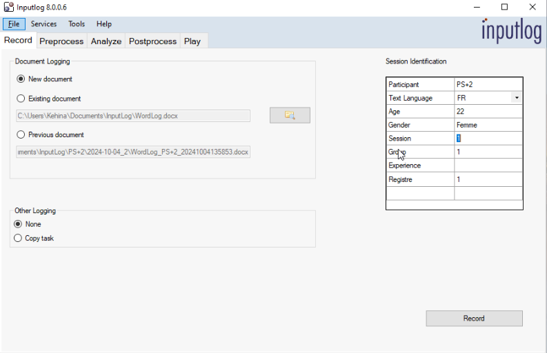  
3. After providing the required information, click on **"Record"**.  
4. This will open a **blank Microsoft Word document**.  
   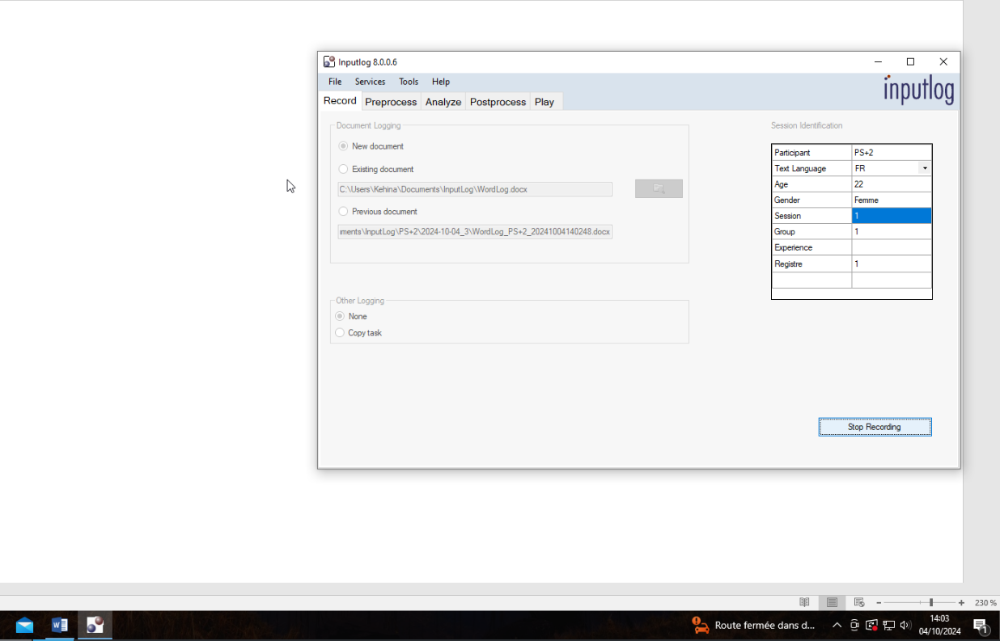  
5. To confirm that InputLog is recording your actions, click on the **InputLog icon** in the toolbar.  
   - A window should appear displaying **"Stop Recording"**.  
   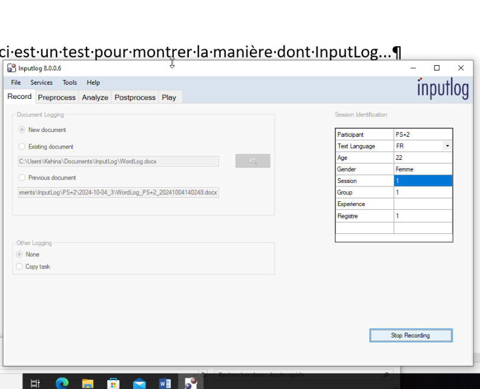  
6. After writing your text, click on the **InputLog icon** again and select **"Stop Recording"**.  
7. Your document should be **automatically saved**, but you can press `CTRL + S` just in case.  
8. Close InputLog.  
9. Your **Word document** and an **InputLog data file** will be saved on your computer.  
   - They are typically stored in the `Documents` directory, organized by **user and session**.  
   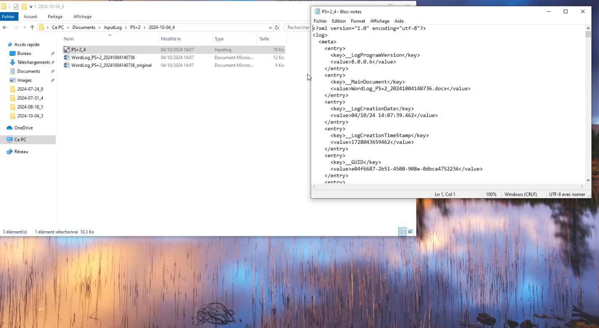  
10. You can open the **InputLog file** with any text editor (e.g., **Notepad**) to see the **IDFX format**.  

Using **InputLog** is extremely helpful for understanding how certain **errors** may occur during **retrieval** or **reconstruction**.  
One of the best ways to analyze these errors is to **manually follow an IDFX file** and try to **rewrite the text yourself**.  

However, manually recording text can be **time-consuming**, and it’s easy to lose track of what you're writing.  

### **Tips for Efficient Analysis**  

- **Record your screen** while writing.  
- **Use Macros** to display the **character index** in the bottom-left corner of your window.  
- Many **macro functions** for this purpose can be found online.  

It might not always work, but here’s an example:
``` Dim NextUpdate As Date 
    Sub StartTracking() ' Start the tracking process 
    Call TrackCharacterIndex 
    End Sub 
    
    Sub TrackCharacterIndex() 
    Dim charIndex As Long 
    Dim charCount As Long ' Get the current character index 
    charIndex = Selection.Start ' Get the total character count in the document 
    charCount = ActiveDocument.Content.Characters.Count ' Display the current character index in the status bar 
    Application.StatusBar = "Character Index: " & charIndex & " of " & charCount ' Schedule the next update 
    NextUpdate = Now + TimeValue("00:00:01") 
    Application.OnTime NextUpdate, "TrackCharacterIndex" 
    End Sub 
    
    Sub StopTracking() ' Stop the tracking process 
    On Error Resume Next Application.OnTime EarliestTime:=NextUpdate, Procedure:="TrackCharacterIndex", Schedule:=False Application.StatusBar = False ' Clear the status bar 
    End Sub
```

Good luck !

## IDFX Files


I will now explain in detail how **IDFX files** (generated by InputLog) are structured and how these structures should be considered for further processing.  

---

### **Basic Structure**  

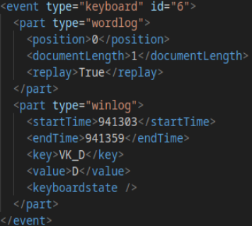

Each **IDFX file** contains a sequence of **actions recorded in Word**.  
For example, in the image above, the user pressed the `D` key at **position 0**.  

IDFX files are structured around **tags**.  

The most common tag in these files is the **`keyboard` event**, which corresponds to pressing a key on the keyboard.  

Each `keyboard` event consists of **two** `<part>` tags:  

1. **`wordlog` part tag**  
   - Provides information about **cursor position** for the pressed key.  
   - Records the **length of the document** after that key press.  
   - The `<replay>` tag is set to `False` for control keys like `SHIFT` or `BACK`.  

2. **`winlog` part tag**  
   - Gives information about:  
     - **Start time** (e.g., 941,303 ms)  
     - **End time**  
     - **Key name** (e.g., `VK_D`)  
     - **Corresponding grapheme** (e.g., `D`)  
   - Includes the **keyboard state**, which will be explained later.  
   - Used for **mouse actions**, but those do not concern us.  

---

## **Special Keys**  

To properly process these files, you need to recognize **special keys**:  

### **Letters & Control Characters**  

- **Letters** are represented as `VK_X`, where `X` is the letter.  
- **Uppercase letters** are represented the same way but preceded by a `SHIFT` key.  

| Action           | Key Name   |
|-----------------|-----------|
| Space          | `VK_SPACE` |
| Tabulation     | `VK_TAB` |
| Delete         | `VK_BACK` |
| Forward Delete | `VK_DELETE` |
| Move Left      | `VK_LEFT` |
| Move Right     | `VK_RIGHT` |
| Move Up        | `VK_UP` |
| Move Down      | `VK_DOWN` |
| Line Break     | `VK_RETURN` |
| Jump to End    | `VK_END` (rare) |

### **Special & Accent Keys**  

| Key Name      | Function |
|--------------|----------|
| `VK_RSHIFT`  | Right Shift key |
| `VK_LSHIFT`  | Left Shift key |
| `VK_CAPITAL` | Caps Lock |
| `VK_OEM_2`   | `:` or `/` (with `SHIFT`) |
| `VK_OEM_3`   | `ù` or `%` (with `SHIFT`) |
| `VK_OEM_4`   | `)` |
| `VK_OEM_5`   | `*` |
| `VK_OEM_6`   | `^` (circumflex) or `¨` (diaeresis) |
| `VK_OEM_8`   | `!` |

### **Punctuation & Number Keys**  

- `VK_OEM_COMMA`: **`,`**  
- `VK_OEM_COMMA` (with `VK_CAPITAL`): **`?`**  
- `VK_OEM_PLUS`: **`=`**  
- `VK_DECIMAL`: **`.`**  

#### **Number Keys**  

| Key | Character |
|-----|----------|
| `VK_1` | `&` |
| `VK_2` | `é` |
| `VK_3` | `"` |
| `VK_4` | `'` |
| `VK_5` | `(` |
| `VK_6` | `-` |
| `VK_7` | `è` |
| `VK_8` | `_` |
| `VK_9` | `ç` |
| `VK_0` | `à` |

**Note:** Many other characters are created using **key combinations** (e.g., `VK_RSHIFT + VK_OEM_PLUS` for `+`).  

### **Other Functional Keys**  

| Key Name      | Function |
|--------------|----------|
| `VK_LMENU` / `VK_APPS` | Opens a menu |
| `VK_ESCAPE`  | Escape key |
| `VK_F12`     | Save shortcut |
| `VK_SNAPSHOT` | Screenshot key |
| `VK_INSERT`  | Toggles writing mode |
| `VK_LCONTROL` / `VK_RCONTROL` | Control keys |


The `keyboardstate` element is useful when handling characters created by pressing a `SHIFT` key beforehand. This "state", so the fact that we are in the UPPER case mode, is stored in the `keyboardstate` element.

---

## retrieval.py

Now, let's analyze the **`retrieval.py`** script.  

The script is **heavily commented**, so I recommend following these explanations while reading the code.  

- The script is **long** and contains **large functions**.  
- Errors may occur if the script encounters **unhandled characters**.  
- To debug, remove the `Try Except` block in the `main` function.  
- **It has been tested and works for all files in the `planification` corpus.**  

## **Running the Script**  

The script uses **argparse** and requires two arguments:  

- `-c` → The **name of the folder** containing the IDFX files.  
- `-t` → The **pause threshold** (in seconds) to segment the data into bursts.  

Example: ```python3 retrieval.py -c planification -t 1.5```

This script processes IDFX files and generates a CSV file named after the chosen corpus in the `data/table/` directory. It reconstructs the writing process while handling various complexities such as control characters and position shifts.

## **How Bursts and Rows are Handled**

A **burst** can span multiple rows in the resulting CSV file. Each row has **start** and **end** positions. However, some control characters (e.g., `VK_LEFT`, `VK_RETURN`) cause jumps in positions, disrupting text reconstruction. To address this, whenever a **non-linear movement** (any movement other than a 1-position right shift) is detected, a new row is created.

The script uses dedicated **dataclasses** to manage these structures:
- **`Row`**: Represents one row in the CSV file.
- **`Burst`**: A list of `Row` objects that together form a burst. Some bursts may contain only one row.
- **`Bursts`**: A collection of all bursts in a file. Each IDFX file corresponds to a separate `Burst` instance.

## **Processing IDFX Files**

The script extracts actions from IDFX files using the `get_burst_rows` function. This function:
- Retrieves each **keystroke event** and its associated information (position, keyboard state, etc.).
- Handles cases where the next event is required to compute pauses.
- Deals with **missing timestamps** and **non-keyboard events**.
- Manages **selection events**, which reset position tracking.

### **Handling Accents and Position Shifts**

Accents complicate position counting. For example:
- Typing `^` alone does **not** count as a position.
- Typing `ê` after `^` correctly registers **one position**.
- Typing `t` after `^` results in `^t`, which **takes two positions** but might be miscounted.

To correct such shifts, the script adjusts a `shifts` variable. The **positions recorded in IDFX files reflect the character positions at the time of typing**, so a complete reenactment of writing is required for accurate reconstruction. **Selection events reset the position counter**, fixing previously introduced shifts.

Many, many, many, cases needed to be handled individually. Each case corresponds to the `if` conditions in the function. Most of them concern adjusting positions by handling cases where modifying the current element requires modifying the preceeding one. I highly recommend listing those exceptions. I can tell you, for instance, that problems seem to arise when the `TAB` key is used by the user. I recommend trying to find all of the "special" keys in the IDFX files before processing to try to find inacuraccies in the position counting or in any other aspect. 

## **Segmenting Bursts into Rows**

The `divide_bursts` function splits bursts into **rows**, handling intra-burst movements. The `get_len` function calculates:
- **Number of actions** in a row.
- **Number of deletions** and **movements**.
- Characters added inside and outside the burst.

The `first_deletions` function provides additional deletion-related metrics.

## **Categorizing Bursts**

Bursts fall into three categories:
- **Production (P)**: New content added at the end of the text.
- **Edge Revision (ER)**: Edits made to the previous burst.
- **Revision (R)**: Edits made to an earlier burst.

Revisions can involve:
- **Adding** characters or spaces.
- **Deleting** characters or words.
- **Using control characters** to navigate the text.

A burst may contain **multiple types** since a user can move through the text and modify different sections within the same burst.

## **Generating the CSV Output**

Finally, the extracted data is saved into a CSV file in `data/table/`. The output structure ensures that:
- Each **burst** and its corresponding rows are correctly categorized.
- **Position shifts** are accounted for.
- **Control characters and deletions** are properly handled.

### **Example CSV Output:**

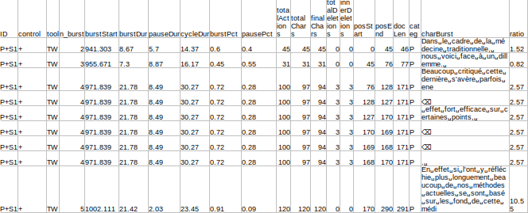

This structured format allows for accurate **text reconstruction and analysis**.

# 2 - TEXT RECONSTRUCTION <a name="reconstruction"></a>

Multiple choices and parts of the code in the `retrieval.py` script can be explained by problems that were raised while working on the text reconstruction. 

## Main logic

Dividing bursts into multiple rows was a choice made to allow text reconstruction.
To do so, the most logical process seemed to go trhough each row of the CSV file and simply add or delete each string of characters by using the corresponding positions in the position columns. 
This linear process was made impossible by the movements within a single burst and by many other elements regarding the combination of characters for diacritics for instance. 

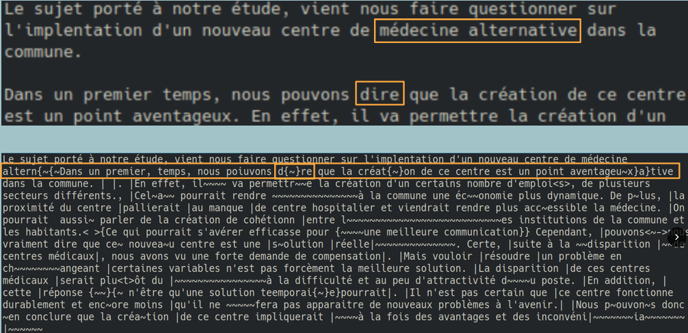

The original retrieval script ignored most of these exceptions and led to reconstruction errors such as the one presented above. 


Dividing bursts into multiple rows and isolating actions such as deletions (by keeping only one deletion by line) seems to significantly improve text reconstruction. However, there are still many cases to handle and understand.

## Legend

The interesting aspect of text reconstruction was to find a way to represent actions that did not appear in the saved text. For instance, if a saved text was only 4 lines long because half of it was deleted before saving, we wanted to be able to show the number of deleted characters.

With this goal in mind, we decided on multiple symbols to represent different actions : 
- `|` were used to represent pauses, and therefore the boundaries between each burst. *Working on how to represent those is an interesting point of interest. Indeed, if a user makes a pause, and goes back to the very beginning of the text, it becomes impossible to use the final texts as a way to study what preceeds or follows a pause. In this case, a pause may not be connected to its spatial surrouning but more to the top section of the text that led to the pause. It's important to take that into account at one point and find a way to track the start of the pause and where it led the user if they did not directly continue to write after the current sequence. This point higlights the difference between burst of actions and burst of writing.*
- `~` were used to represent deletions. When a character (letter, space...) is deleted, then it will be represented by a ~ instead. *An interesting followup would be to keep track of the deelted characters to see which ones are most often deleted*.
- `<` and `>` were used to represent single character insertions. If a single `s` is added to a former burst, it will be represented as such `<s>`. Chevrons can be found around single inserted deletions and spaces.
- `{` and `}` were used to represent string insertions. When a string of characters is added to a former burst, it will be represented as such `{ent.}`.

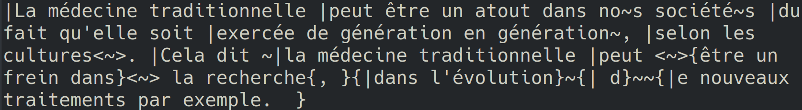

## reconstruction.py

Multiple choices and parts of the code in the `retrieval.py` script were influenced by issues encountered during text reconstruction.

### **Challenges in Text Reconstruction**

Dividing bursts into multiple rows was necessary to facilitate accurate text reconstruction. Initially, a linear process was planned where each row of the CSV file would simply add or delete characters based on the recorded positions. However, this approach was disrupted by:
- **Movements within a single burst**
- **Special cases like diacritic combinations**


The original script ignored most exceptions, leading to reconstruction errors such as the one above. The refined approach isolates actions such as deletions (keeping only one deletion per line), significantly improving reconstruction accuracy. However, many edge cases remain to be analyzed and addressed.

## **Legend**

An essential part of text reconstruction is representing actions that do not appear in the saved text. For example, if half of a text is deleted before saving, the deleted characters should still be accounted for.

To achieve this, we introduced specific symbols to denote different actions:

- **`|`** represents pauses, marking burst boundaries. *If a user pauses and then moves to the start of the text, tracking its impact becomes challenging. Instead of linking a pause to adjacent text, it might be connected to an earlier section that led to the pause. This distinction highlights the difference between bursts of actions and bursts of writing.*
- **`~`** represents deletions. Deleted characters (letters, spaces, etc.) are replaced with `~`. *A possible improvement would be tracking which characters are most frequently deleted.*
- **`<` and `>`** denote single-character insertions. If an `s` is added later, it appears as `<s>`. These brackets also surround single inserted deletions and spaces.
- **`{` and `}`** denote string insertions. When a sequence of characters is added, it is shown as `{ent.}`.


This approach enhances visibility into the text editing process, aiding in understanding user behavior and improving reconstruction accuracy.

---

## Reconstruction.py


The script starts by grouping the rows in the CSV file based on users. Each user is then processed individually within the main function.

The CSV file is converted into a dataframe that marks:
- The **beginning of each burst**.
- The **boundaries of revisions**.


To accurately track text modifications, a list is created where each **letter** is stored as an element. Each letter's **position** corresponds to its **index in the list**, which matches the positions in the IDFX file.

Each element is stored as a **tuple with three components**, allowing the script to track modifications, even when characters are deleted. For example, consider the word **"Écoutes"**:

1. If the **"s"** is removed, its corresponding tuple `("", "s", "")` is deleted based on its position.
2. A deletion marker (`~`) is added to the **third element** of the preceding character's tuple. The "e" tuple changes to: `("", "e", "~")`.
3. When the list is converted back into a string, the result is: **"Écoute~"**, indicating that a character was removed at the end of the word.

This method ensures that the **number of indices remains consistent** with positions in both the IDFX and CSV files at any point in the process.


Since **deletions and insertions** constantly modify positions, tracking them is crucial. Following each row of the CSV allows for real-time position updates.

- Positions **change dynamically** throughout the writing process.
- The **index in the list** must always be used for deletions or insertions.
- **Obsolete positions** from previous CSV rows or the original IDFX file should never be relied upon.

This approach ensures precise **text reconstruction and modification tracking**, preventing inconsistencies that could arise from outdated position references.


For each row in the dataframe, the script retrieves:
- The **string of characters**.
- The **category of the burst**.
- The **start and end positions**.

Different types of rows require different handling strategies:

- The **first row** is simply added to the list.
- If a **deletion** is detected, several conditions must be checked:
  - Does the deletion occur **before any text is written**?
  - Does it occur **beyond the text boundaries** (e.g., at the very bottom of the document)?
  - Does it affect a **character at the boundary of an insertion**?

### **Handling Deletions at Insert Boundaries**

Consider the string:  
**"Je {ne} sais pas trop quoi faire"**  

If the user deletes the character at **position 3** (`"n"`), we need to consider the **curly bracket** associated with it in the tuple:  
`("{", "n", "")`

- The **opening curly bracket (`{`)** must be moved to the `"e"` tuple.
- If `"e"` is subsequently deleted, the **curly brackets must be completely removed**.

All these edge cases are handled by the **`deletions_string_insertions`** function.

### **Executing Deletions**

After processing special cases, each row is passed through the **`deletions`** function, which **removes the character from the list based on its index**. This ensures that text modifications are correctly reflected throughout the reconstruction process.


Similar processes are required in the **`insertions`** function to correctly add characters while maintaining structural consistency. When a character is inserted:
- It must be associated with a **pipe (`|`)** if it appears at a **burst boundary**.
- It must be enclosed within **curly brackets (`{}`) or chevrons (`<>`)** if it is part of a **revision burst**.

**Validating the Reconstruction Process**

The **`validate`** function compares each **reconstructed text** (after replacing all special symbols) with its **saved version**. If the two texts are not identical, an **error in reconstruction** has occurred, and the reconstructed text is **removed from the directory**.

By removing the option to delete failed reconstructions, you may notice that some errors appear **minor**, such as:
- A **missing line break**.
- A **single misplaced letter**.

However, even small shifts can **disrupt annotation accuracy**, causing **symbols to be misplaced** and **falsifying further analyses**.

The reconstruction step is **complex to refine**. For example, **handling replacements** is not entirely resolved but functions well in most cases. 
To improve the script and adapt it to **new edge cases**, it is highly recommended to **use the debugging function**.
# 3 - Chunking <a name="chunking"></a>

Following the reconstruction phase, the next step involves chunking the reconstructed texts. 

Chunking is a linguistic segmentation process that divides text into non-recursive units. Various chunking conventions exist, and for this project, we have adopted the convention used in the **SEM** software.

SEM is an annotation tool for French that supports **part-of-speech (PoS) tagging, chunking, and named entity recognition (NER)**.

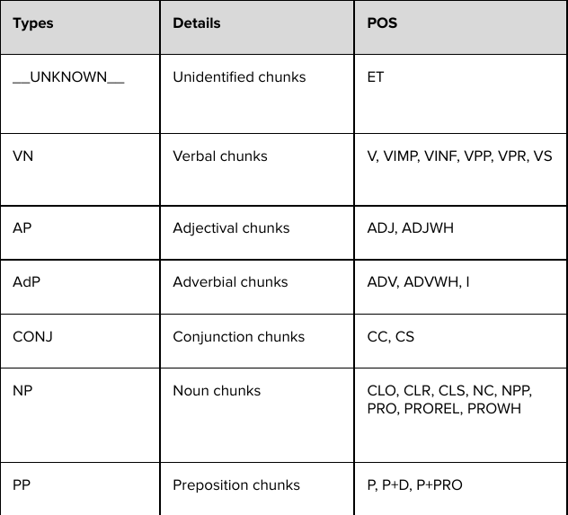

Implementing chunking adds a **new layer of linguistic analysis**, enabling us to examine the relationship between **pauses, behavioral markers, and linguistic units**. Specifically, this allows us to investigate whether pauses predominantly occur before specific chunk types.

### Chunking Workflow

The chunking process consists of several key steps:

1. **Installing SEM**  
   SEM can be installed from its official [GitHub repository](https://github.com/YoannDupont/SEM).

2. **Preprocessing the Input Text**  
   Once SEM is installed, the chunking process is executed through the `chunking.py` script. This script consolidates all steps into a single automated pipeline using **subprocess** to streamline execution.

   - The first step involves **replacing punctuation marks from the reconstruction phase with invisible characters**. This improves chunking accuracy since punctuation can significantly influence results.

3. **Applying Chunking with SEM**  
   After preprocessing, the SEM command for chunking is executed on each input text. The raw output from SEM is stored as an **XML file**, which is immediately reformatted within `chunking.py` for easier extraction and processing.

4. **Post-Processing and Cleaning the Output**  
   Once XML files are generated and structured, the script extracts relevant **XML tags** and applies several modifications. Chunks are stored as **a list of tuples**, each containing the chunk’s string representation and its corresponding type.

   Example output:

   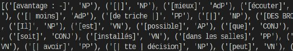

   Several additional processing steps are applied for better analysis:

   - **Isolating Pauses**  
     Pauses occurring at chunk boundaries are extracted and stored separately. This facilitates counting and analyzing **inter-chunk pauses** more effectively.

     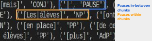

   - **Reintegrating Behavioral Punctuation**  
     Punctuation marks used to indicate behaviors are adjusted when necessary. For instance, **curly brackets at chunk boundaries** are reattached to the previous or following chunk when needed.

     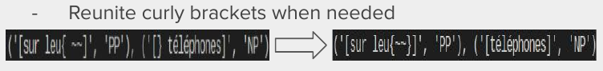

   Further refinements may be required depending on the analysis needs.  
   Finally, the structured output is **saved as a JSON file** for further reuse and exploration.

---

# 4 - Statistics <a name="statistics"></a>

As previously mentioned, this stage requires significant customization. The resulting JSON file serves as a **foundation for various types of analyses**.

Within the `scripts/stats/` directory, multiple scripts are available to generate **preliminary insights**. These scripts allow for the examination of **pauses in relation to linguistic chunks, behavioral markers, or a combination of both**. They can also be used for **descriptive statistical analyses**.

At this stage, the scripts provide useful initial insights into factors influencing pauses in written production.

### Example Analyses:

- **Pauses and Chunk Boundaries**  
  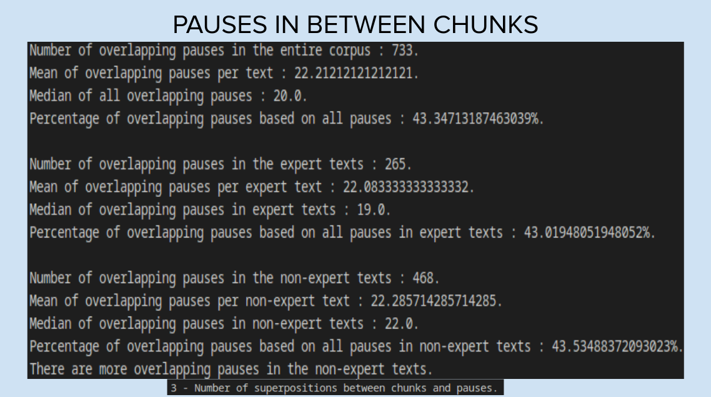

- **Pauses and Behavioral Patterns**  
  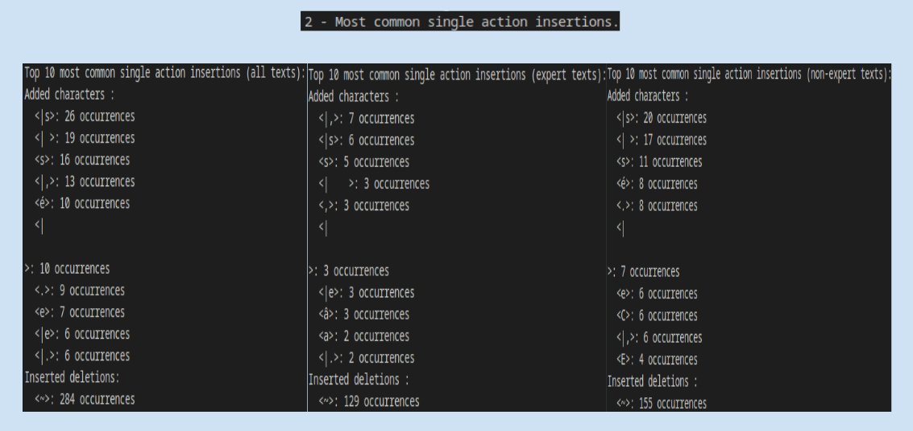

- **Comprehensive Analysis of Pauses**  
  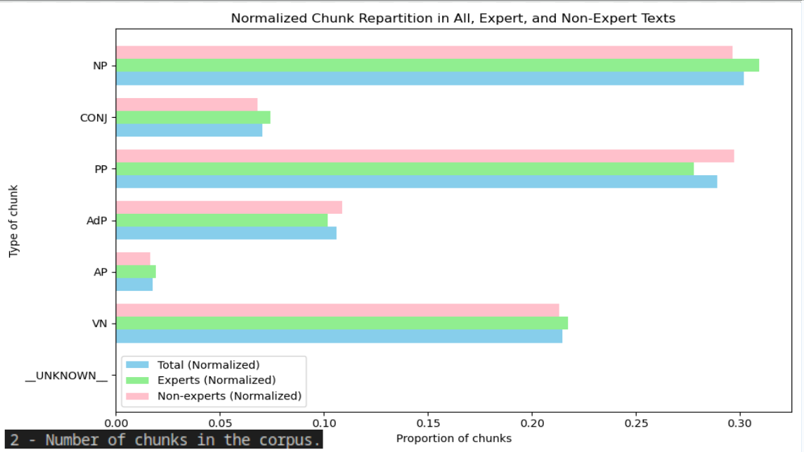

These scripts offer an initial overview and can be extended to explore deeper relationships between **linguistic structures and pauses**.
