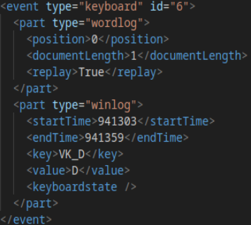
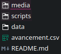
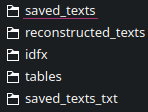
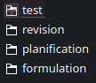
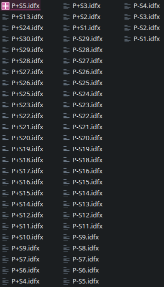
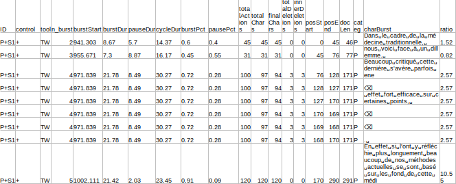

# Real Time Writing Analysis - ProText ANR

*"The Pro-TEXT project aims to elucidate the dynamics of the textualization process by modeling the relations between the temporal indices of cognitive processes (such as pauses) and the nature of bursts of writing in French and in English-French translations. We argue that the way linguistic sequences linearly articulate during the process of textualization accounts for: i) the multilevel constraints underlying language performance and ii) specific relationships outside the scope of clause syntax."*

# Table of contents
1. [Introduction](#introduction)
2. [Data extraction](#extraction)
3. [Text reconstruction](#reconstruction)
4. [Chunking](#chunking)


## 1 - Introduction <a name="introduction"></a>

This repository concerns a specific branch of the project aiming to find connections between pausal segmentation and specific linguistic features, notably chunks. You can find the main focus on this study in this presentation introduced during the SigWriting 2024 conference. 


To get to that point, a few steps were required :
- Extracting our data to make it "usable"
- Reconstructing texts while keeping a history of the user's writing behaviours
- Chunking those texts to find connections between them, pauses, and types of errors

Mupltiple experiments were conducted on subjects of various age groups. The ones used for this particular study are BA students in psychology. Those subjects were instructed to write texts (from 5 to 20 lines in average) regarding a given topic: student fees, smoking in college, pollution... Some were considered "experts" in those fields whereas others weren't. Each subject is named by the first letter of the corpus, a "+" or "-" symbol to indicate the level of expertise, and a ID number. For instance : P+S2, R-23, F+14...

The subjects wrote their texts in Word and their movements were recorded thanks to the InputLog software on Windows. No limitations were given, subjects could therefore move throughout their texts, erase elements, select others, and more generally press any key the wanted. Those pressed keys were saved in resulting idfx files.

For instance : 



In order to study each subject's behaviour while writing, we firstly need to use those idfx outputs to reconstruct every text automatically.

## 2 - Data extraction <a name="extraction"></a>

The `retrieval.py` script (STILL IN CONSTRUCTION) aims to retrieve the data from each idfx file to create a resulting csv file containing all the informations needed to recontruct the texts. This csv file would also allow for a new level of division based on bursts.

This script aims to handle as many cases as possible, some of them requiring different processing. For instance, diacritics, tabulations or replacements required multiple conditions to avoid as many problems as possible during the reconstruction. 

The script requires : 

- A folder named `data` that contains another folder named `idfx`. This idfx folder should contain as many folders as   corpora. For now (TO COMPLETE), it contains four folders : `planification`, `revision`, `formulation` and `test`, the latter being used for testing purposes. Each folder should contain their corresponding idfx files. Those files should be named with the first letter of the corpus, the level of expertise, and the number attributed to each subject. This structure and the names of the files/folders need to be respected for the script to work. Otherwise, you'll need to make changes in the argparse and in the function sorting the files. Here is a example: 







- An updated version of `python3` as well as the following libraries/modules: `os`, `BeautifulSoup`, `bs4`, `csv`, `dataclass`, `typing`, `argparse`.

- The script uses an argparse that contains two required arguments : `corpus` / `-c` and •`threshold` / `-t`.
`corpus` corresponds to the desired folder to be processed, so for now : `planification`, `revision` or `formulation` and `threshold` corresponds to the duration (in seconds) that will be used to divide bursts. 

- The output is a csv file containing data for all of the subjects in the folder `data/tables`. The resulting table is named after the chosen corpus.

**Here is an example of command :**

```python3 retrieval.py -c planification -t 1.5```

(TO COME) **An explanation of the script will be available in a manual dedicated to understand all of the different cases that required a specific processing**

- The output should look something like this : 



(TO COME => description of the data, probably in the manual !)

This output allows for the reconstruction of our texts as well as for a better understanding of the user's behaviours. 


## 1 - Text reconstruction <a name="reconstruction"></a>

On top of the idfx files, we have access to the texts in their final forms as they have been saved on Word by the users. These documents were converted from `docx` to `txt` using the script `docx_to_txt`. (TO COMPLETE).

The first step was to reconstruct our texts based on the idfx files and compare the results to the saved texts. For the reconstruction, we use the script `reconstruction.py`.

This script goes through the entire csv and for each text, goes through each row to retrieve the action (add a string, erase something, move...) and the corresponding positions. The text is constructed based on a list that gets updated based on its indexes at each row. The performance of this script depends on the number of specific cases taken into account in the `retrieval` script as well as on some conditions dealing with the specifities on Word and how they may sometimes require some adaptations. 

The script requires : 

- A table constructed thanks to `retrieval.py` located in the following folder: `data/tables`. 

- An updated version of `python3` and `pandas`.

- The output is as many `txt` files as processed files in the csv in the the `reconstructed_texts` folder. These files are named after their corresponding idfx files. 

- You can compare those resulting files to the saved texts thanks to the `comparison.py` script. A performance of 100% is nearly impossible for the reasons that will be explained in the manual (TO DO).

**Here is an example of command :**

```python3 reconstruction.py```

CHUNKING IN PROGRESS...

